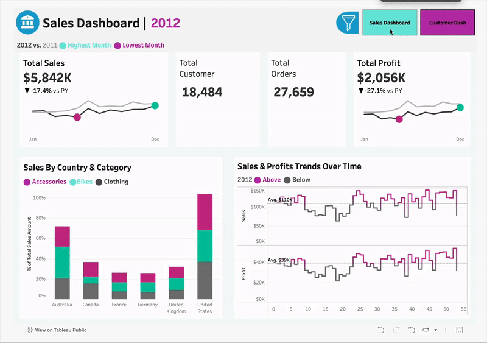
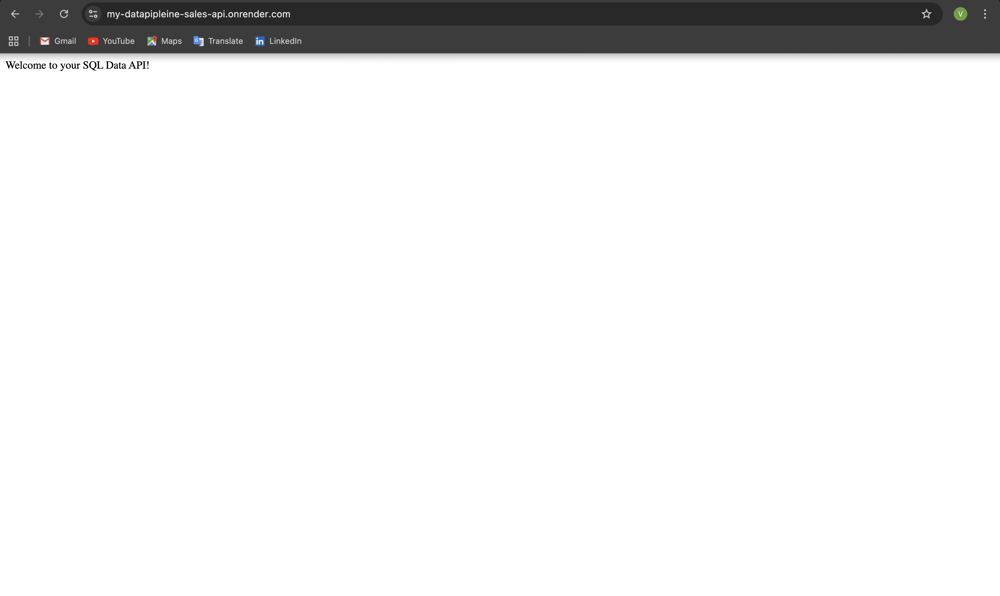
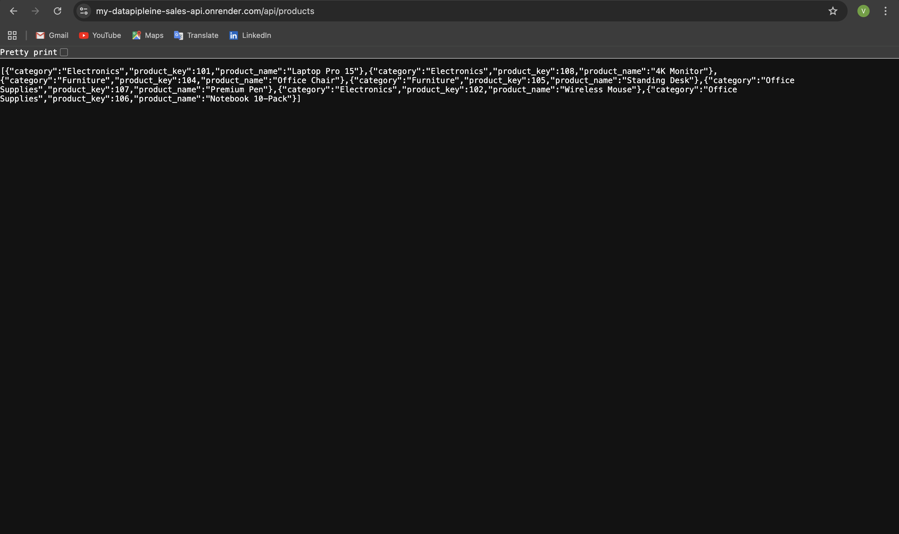

# End-to-End Sales Analytics Pipeline with REST API :
## SQL Data Warehouse -> Tableau Dashboards -> API Enablement

## >> Project Overview 

Welcome to the **Data Warehouse & BI Analytics with RESTful API** Project repository!  

This project demonstrates a full-scale data solution, transforming raw, disconnected sales data from multiple sources into a **unified data warehouse**. This warehouse serves as a single source of truth for **driving strategic business decisions** through advanced **SQL analytics** and **interactive Tableau dashboards**. Designed as a portfolio project, it highlights industry best practices in data engineering and analytics.

- The core of this project is a robust, automated data pipeline built entirely within **Microsoft SQL Server**, following a modern **Medallion Architecture** to ensure data integrity and scalability.

- This follows a full-scale **Data Analytics** and **Exploratory Data Analysis (EDA)** utilising MSSQL to scrape out business insights and transform our cleaned data into a more presentable, report-friendly format.

- It ends with creating two **interactive visualisations** of the refined data in the form of **Tableau Dashboards**. And then finally creating a web-based API for getting browser based requests and perfrom CRUD actions on our create data-warehouse online.
 
---

## >> Business Objective

The primary goal was to consolidate disparate sales, customers and products data from ERP and CRM systems into a centralised data warehouse. This solution empowers business users with self-service analytics to:

- Uncover deep insights into customer behaviour and product performance.
- Identify and analyse key metrics that drive business decisions.
- Enable data-driven decision-making to boost profitability and customer retention.
- Deploy a Web-based interactive API to integrate our data model with browsers and URLs.

---

## >> Building the Data Warehouse (Data Engineering)

### > Solution Architecture

The project follows a three-layered Medallion Architecture, ensuring a clear and organised data flow from raw ingestion to a final, analytics-ready state.

### > Technical Stack
- **Database**: Microsoft SQL Server
- **Data Transformation & Analysis**: T-SQL (Stored Procedures, Views, CTEs, Window Functions)
- **Business Intelligence & Visualization**: Tableau (Tableau Public)

### > The Data PipeLine (SQL)
The entire ETL (Extract, Transform, Load) process is automated using T-SQL stored procedures, creating an efficient and repeatable pipeline.

#### -> Bronze Layer: Raw Data Ingestion
Serves as the initial landing zone for raw, unaltered data from source CSVs.

- Creation of **'Bronze' layer tables**, primarily serving as the ingestion tables from the source datasets, without any transformations of modifications.
- A stored procedure automates data loading using the high-performance **BULK INSERT command**.

#### -> Silver Layer: ETL & Data Cleansing
This is the staging layer where data is cleansed, conformed, and integrated.
- **Process** : An **ETL** stored procedure transforms data from the Bronze layer.
- **Key Transformations**: Data type validation, handling of NULLs, business rule application, and joining of CRM and ERP data into an integrated tables consisting all the required information in one place.

#### -> Gold Layer: Business-Ready Dimensional Model
The final, analytics-optimised layer providing a single source of truth for reporting.
- **Design**: Implemented a **Star Schema** with dimension and fact tables to streamline analytical queries.
- **Implementation**: Created as **SQL Views**, refined it in the most business friendly format, ensuring business users always have real-time access to the most refined data.

---

## >> Analytics & Business Intelligence (BI)

### > SQL-Driven Exploratory Data Analysis (EDA)
Two primary analytical reports were created as SQL Views on top of the Gold layer to serve key business functions.

#### -> Product Performance Report
- **Segmentation**: Classifies products into High-Performers, Mid-Range, and Low-Range tiers based on revenue.
- **Key Metrics**: Total Orders, Total Sales, Quantity Sold, Unique Customers.
- **Calculated KPIs**: Product Lifespan, Recency (months since last order), Average Order Revenue.

#### -> Customer Insights Report
- **Segmentation**: Groups customers into VIP, Regular, and New categories, along with age-based cohorts.
- **Key Metrics**:Total Orders, Total Sales, Quantity Purchased, Unique Products Bought.
- **Calculated KPIs**: Customer Lifespan, Recency, Average Order Value (AOV), Average Monthly Spend.

These insights empower stakeholders with key business metrics, enabling strategic decision-making.

---

## >> Interactive Tableau Dashboards 
The refined data from the Gold layer was connected to Tableau to create a dynamic BI solution. 
- Tableau Public Profile Link: [View the Dashboard on Tableau Public](https://public.tableau.com/app/profile/vipul.b1538/viz/Dashboard_Project_17547917490050/CustomerDashboard)

#### -> Dashboards Created  

- **Sales Dashboard**: Provides a high-level overview of sales trends, geographical performance, and profit analysis by product category.

- **Customer Dashboard**: Focuses on customer segmentation, demographic analysis, and identifying top customers & products by sales and order volume.

#### -> Key Features
- **Interactive Filters**: Allows users to dynamically slice data by date, region, and product category.
- **Drill-Down Capabilities**: Enables exploration from a high-level summary to granular details.
- **Cross-Dashboard Navigation**: Seamlessly switch between the Sales and Customer views with interactive buttons.

---

## >> How to Run This Project

#### -> Pre-Requisites
- Microsoft SQL Server (2017 or later).
- SQL Server Management Studio (SSMS) - For Windows Operating System.
- Docker and Azure Data Studio (Recommended) - For MacOS and Linux Operating Systems.
- Note: If on MacOS/Linux device, make sure to create Volume Container while setting up your docker virtual environment to ensure smooth ingestion through BULK INSERT method.

#### -> Set-up & Execution
- Clone the repository.
- Create a database named *DataWarehouse*.
- Follow the numbered SQL scripts in the /Data-Warehouse/scripts folder to set up the schemas, tables, and stored procedures.
- Update the file paths in the proc_load_bronze.SQL script to your local CSV location.
- Execute the stored procedures to run the data pipeline.
- Query the Gold layer views to see the final, analytics-ready data.

---
## >> Cloud-Deployed REST API for Live Web-Based Analytics

To make the insights from the data warehouse accessible for modern applications, I developed and deployed a production-grade RESTful API. This API serves the cleaned and aggregated data from the Gold layer, enabling real-time analytics and integration with other services.
- Live API Base Public URL: [https://my-datapipleine-sales-api.onrender.com](https://my-datapipleine-sales-api.onrender.com)

### API Features Include:  

- **Full CRUD Functionality**: We can perform CREATE(GET), READ(POST), UPDATE(PUT) and even DELETE in this API utilising Postman or similar software.

- **Validation**: Validation was checked via code and our API was tested on only a sample database created at Supabase itself.

- **Error Handling**: It was designed to handle errors in a more user-friendly manner, giving out brief error messsage display that is interpretable.

### > Live API Endpoints
The API exposes the key analytical views, allowing for dynamic data retrieval.

#### -> Get All Products:
- **Endpoint**: */api/products*
- **Description**: Retrieves a complete list of all products with their performance metrics.
- **Live Link**: [https://my-datapipleine-sales-api.onrender.com/api/products](https://my-datapipleine-sales-api.onrender.com/api/products)

#### -> Get Customers By Segment (New,Regular,VIP):
- **Endpoint**: */api/customers/{segment}*
- **Description**: Returns a list of customers belonging to a specific segment (e.g., VIP, Regular, New).
- **Live Link Example**: [https://my-datapipleine-sales-api.onrender.com/api/customers/Regular](https://my-datapipleine-sales-api.onrender.com/api/customers/Regular)

#### -> Get Specific Product Information by Product Key:
- **Endpoint**: */api/products/{product_key}*
- **Description**: Returns a specific product with the key matching as the proivded product_key.
- **Live Link Example**: [https://my-datapipleine-sales-api.onrender.com/api/products/101](https://my-datapipleine-sales-api.onrender.com/api/products/101)

### > API Architecture & Tech Stack
The API was built with a modern, scalable, and cloud-native architecture.

- **Programming Language**: Python
- **Web Framework**: Flask
- **Database**: PostgreSQL (hosted on Supabase)
- **Deployment Platform**: Render (PaaS - Platform as a Service)
- **Container**: Docker
- **Libraries**: SQLAlchemy (for ORM), Gunicorn (for WSGI server)

### > The Deployment Journey: From Local to Live
This project involved a complete end-to-end deployment lifecycle, showcasing skills in cloud infrastructure and DevOps practices.

- **Database Migration**: The initial data warehouse was built on a local SQL Server instance. For cloud deployment, the schema and sample data were migrated to a cloud-native PostgreSQL database hosted on **Supabase**.

- **Containerization with Docker**: The Python Flask application was containerized using a Dockerfile. This ensures a consistent, reproducible, and isolated environment, which is crucial for reliable deployments.

- **Cloud Deployment & CI/CD**: The containerized application was deployed on Render. A CI/CD pipeline was established by linking the service to the GitHub repository, enabling automatic deployments on every git push.

- **Networking & Security**: I configured firewall rules on the Supabase database to securely allowlist the outbound IP addresses from the Render service, ensuring a secure and reliable connection between the API and the database.

### > How to Test the API
- **GET Requests**: The GET endpoints listed above can be tested directly in your web browser.

- **POST, PUT, DELETE**: To test the full CRUD functionality (creating, updating, and deleting products), an API client like Postman is required

---

## >> License

This project is licensed under the [MIT License](LICENSE). You are free to use, modify, and share this project with proper attribution.

---

## >> About Me

Hi there! my name is **Vipul Bharti**. Currently a fresher in this field and an undergraduate hailing from **IIT(BHU), Varanasi**, my work experience includes working as a **Data Analyst Intern** at **Noteables.in**, during my pre-final year at college.

I am an aspiring *Data Analyst* with a passion for uncovering the stories hidden within data. I believe that every dataset holds the potential to solve complex business problems, and my goal is to transform that raw data into clear, actionable insights.

This project is a practical demonstration of my skills in *SQL, data warehousing, ETL processes, and building intuitive BI dashboards with Tableau*. I am actively seeking opportunities where I can apply my analytical mindset and technical abilities to help organisations make smarter, data-driven decisions.

You can reach out to me via mail - *vipulbharti04@gmail.com*
